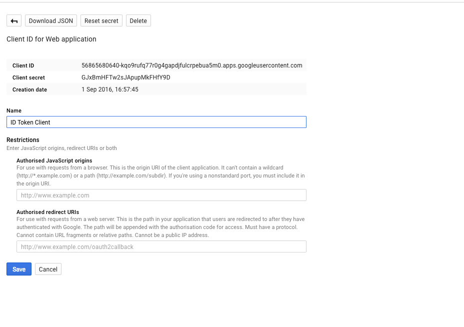
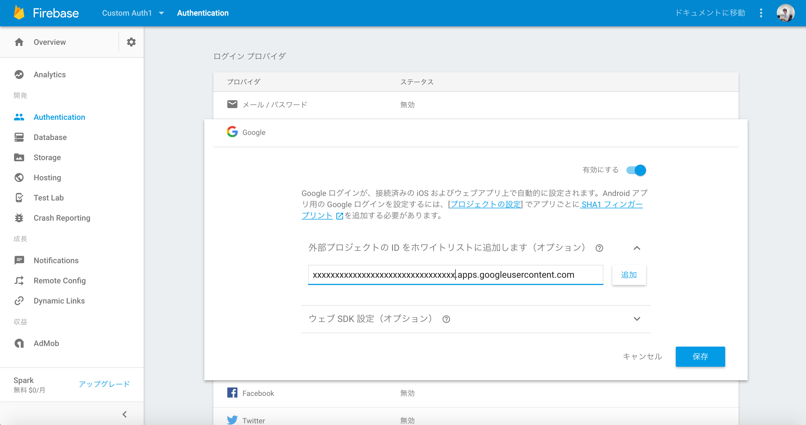
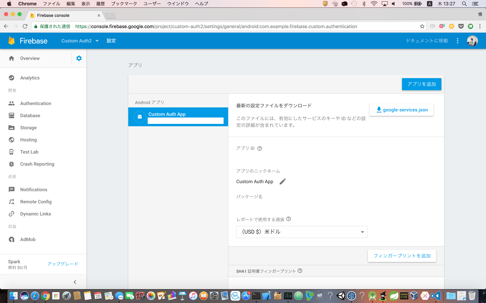

# Firebase Custom Authentication

## Description  
This sample app access the databases from two different Firebase projects using custom authentication.

## Required

1. Create a primary Firebase project  
You need to create a primary Firebase project, and download a google-services.json flie.  
After downloading the google-services.json, copy this into your project's module folder, typically app/.  
<br>
And, you must add SHA-1 fingerprint of your application to Firebase.  
<br>
Please refer to the following link.  
[How to add Firebase to your Android Project.](https://firebase.google.com/docs/android/setup#add_firebase_to_your_app)

1. Create a secondary Firebase project  
You must a secondary Firebase project and register the same app.
But, you must not add SHA-1 fingerprint of your app to the secondary Firebase.

1. Add a client ID in the white list  
You must add a client ID in the white list in the both Firebase projects.
First, you need to create a client ID from the Google project.
<br>
[](https://console.developers.google.com/apis/credentials)
<br>
<br>
Next, back in the both Firebase projects, white list the client ID you just set for the GoogleSignInOptions in the Auth > Sign In Providers > Google section of the Firebase console.
<br>
<br>

<br>
<br>
Be sure to re-download your google-services.json from a primary Firebase project and add it to your Android app.

1. Set up gradle.properties  
This sample app needs to initial settings values.  
You must create gradle.properties and set values into it.


```firebase-custom-authentication/gradle.properties

PRIMARY_FIREBASE_DB_URL = "xxx"
SECONDARY_GOOGLE_PROJECT_API_KEY = "xxx"
SECONDARY_FIREBASE_APPLICATION_ID = "xxx"
SECONDARY_FIREBASE_DB_URL = "xxx"
SECONDARY_FIREBASE_APP_NAME = "xxx"
CUSTOM_AUTH_SERVER_URL = "xxx"

```


+ PRIMARY_FIREBASE_DB_URL  
This is primary Firebase database url.

+ SECONDARY_GOOGLE_PROJECT_API_KEY  
This is an Android API key of the secondary Google project.

+ SECONDARY_FIREBASE_APPLICATION_ID  
This is an application id that registered secondary Firebase project.
<br>
<br>


+ SECONDARY_FIREBASE_DB_URL  
This is secondary Firebase database url.

+ SECONDARY_FIREBASE_APP_NAME  
This is an app name that registered secondary Firebase project.
<br>
<br>


+ CUSTOM_AUTH_SERVER_URL  
This sample app connect to the custom authentication server. So, you need to deploy the custom authentication server.  
This is request url of the custom authentication server.  
For the server side code please refer to the following link.  
[Custom Authentication Server Code.](http://xxx)

## Reference url
[Working with multiple Firebase projects in an Android app](https://firebase.googleblog.com/2016/12/working-with-multiple-firebase-projects-in-an-android-app.html)